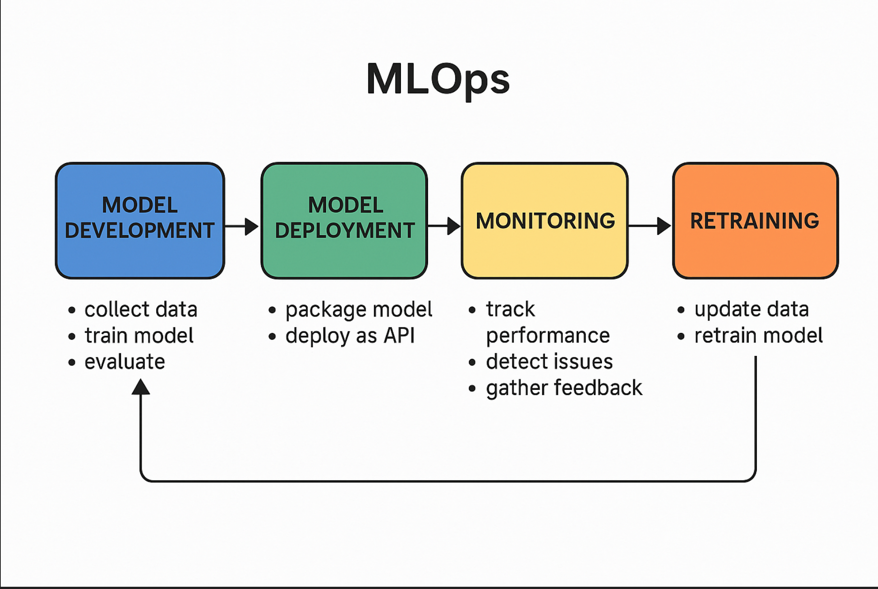

# 🤖 What is MLOps? – Explained with a Spam Email Detector Example

MLOps (short for **Machine Learning Operations**) is the practice of **managing and automating** how machine learning models are built, deployed, monitored, and maintained in real-world environments.

Think of MLOps as **DevOps, but for machine learning**.

---

## 📧 Real-Life Example: Spam Email Detector

Imagine you're building a machine learning model to detect **spam emails**. You train it on thousands of old emails. It works great on your laptop... but now what?

You need to:
- Make it work in a real email system ✅
- Keep it accurate as spammers change tactics ✅
- Update it automatically without starting from scratch ✅

That’s where **MLOps** comes in.

---

## 🛠️ MLOps in Action – Step by Step

### 1. 🧠 Model Development
You:
- Collect email data (spam vs. not spam)
- Train a classifier (e.g., Naive Bayes or Logistic Regression)
- Evaluate it and save the best version

🔧 Tools: `Scikit-learn`, `Jupyter Notebook`, `MLflow`, `Pandas`

---

### 2. 🚀 Model Deployment
You:
- Wrap the model in an API (e.g., with FastAPI)
- Package it using Docker
- Deploy it to the cloud (AWS, GCP, etc.)

Now your model can check new emails live!

🔧 Tools: `FastAPI`, `Docker`, `AWS/GCP/Azure`

---

### 3. 👀 Monitoring
Once your model is live, you want to know:

- Is it still accurate? 
- Are users complaining about missed spam? 
- Is the data it sees changing?

Tools: 
- `Prometheus` + `Grafana` – For performance metrics 
- `WhyLabs`, `Evidently`, `Arize AI` – For ML-specific model monitoring (drift, accuracy, etc.)
- `Logging systems` – To catch errors and track user feedback

Example:
You track how many emails are flagged as spam per day, and notice a sudden drop — maybe spammers changed tactics!

🔧 Tools: `Prometheus`, `Grafana`, `Evidently`, `WhyLabs`

---

### 4. 🔁 Retraining & Automation
When performance drops or new data comes in, you want to retrain the model. But manually doing that every time is slow. MLOps automates it.

Tools:
- Apache Airflow / Prefect / Kubeflow Pipelines – To automate workflows (like retrain every week)
- DVC (Data Version Control) – To track your data and models over time 
- CI/CD tools like GitHub Actions, GitLab CI, Jenkins – To automatically test and deploy new model versions

Example:
Every week, new emails are added to your training set. A pipeline kicks off:
- Cleans the data 
- Retrains the model 
- Runs tests 
- Deploys if performance is better

🔧 Tools: `Airflow`, `DVC`, `GitHub Actions`, `Kubeflow`

---

---

## 🎯 Why MLOps Matters

Without MLOps:
- Models stay stuck in development
- Performance drops over time
- Updates are slow and manual

With MLOps:
- Models are deployed fast and reliably
- Performance is tracked and maintained
- Updates happen automatically and safely

---

## ✅ Summary

MLOps helps take your machine learning model from a **cool project** to a **real, scalable, and reliable product**.  
Using the **spam detector** as an example, MLOps makes sure the model keeps catching spam even as the world (and spam tactics) change.

---

## 🙌 Want to Learn More?

Check out:
- [Google MLOps Guide](https://cloud.google.com/architecture/mlops-continuous-delivery-and-automation-pipelines-in-machine-learning)
- [MLOps Community](https://mlops.community/)
- [Awesome MLOps GitHub List](https://github.com/visenger/awesome-mlops)

---

