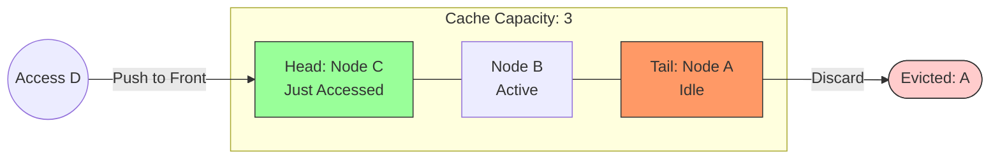
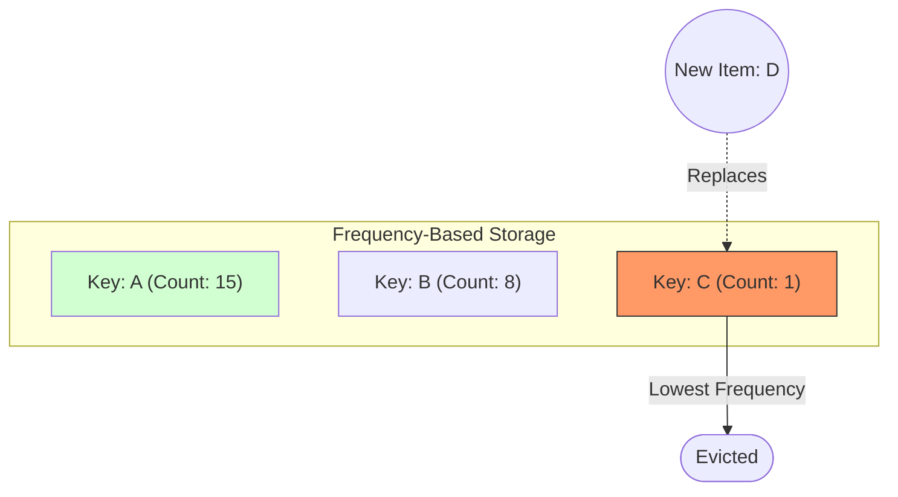
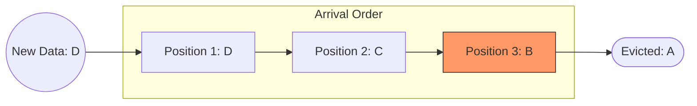
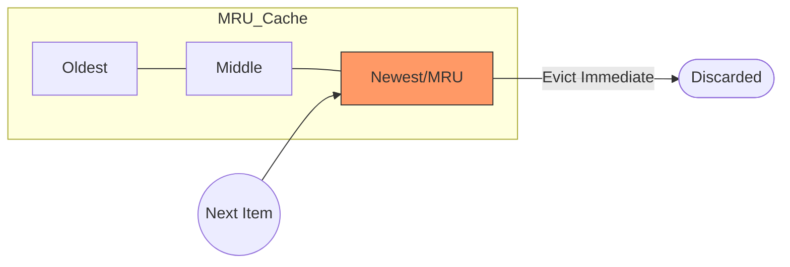
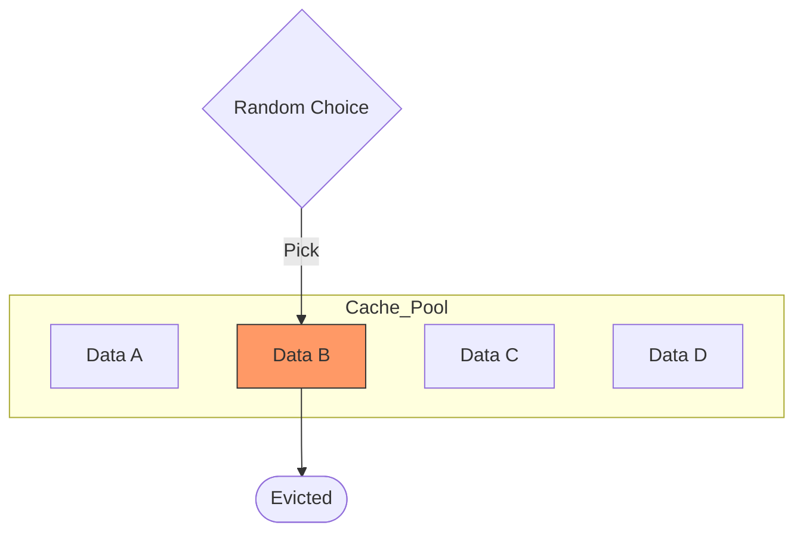

# Cache Eviction Policies: Summary

Cache eviction policies are the algorithms used to decide which data to remove from a cache when it becomes full. Choosing the right policy is essential to maintain a high **Cache Hit Rate** and ensure system performance.

---

## 📊 Summary Table

| Policy | Full Name | Eviction Logic | Ideal Use Case |
| :--- | :--- | :--- | :--- |
| **LRU** | Least Recently Used | Discards the least recently accessed items first. | General web applications (Temporal Locality) (apps on smartphones that are not used very much) |
| **LFU** | Least Frequently Used | Discards items with the lowest access count. | Static content with consistent popularity. (music playlists) |
| **FIFO** | First In, First Out | Discards items in the order they were added. | Simple systems; data with a clear lifecycle (logs, timeseries) |
| **MRU** | Most Recently Used | Discards the most recently accessed items. | Scans where data isn't reused immediately. |
| **RR** | Random Replacement | Randomly selects a candidate for eviction. | Low-memory environments with no clear pattern. |

---

## 1. Least Recently Used (LRU)
**Logic:** Evicts the item that has not been accessed for the longest period. It assumes that if you haven't used data recently, you likely won't need it soon (Temporal Locality).
LRU is a bit more complicated to implement - rather than just having a queue we'd need to use a hashmap with a doubly linked list. We need a hashmap to identify the node to move to the head of the list, and a doubly-linked list to be able to shift things around in O(1) time.

## 2. Least Frequently Used (LFU)
**Logic:** Each item has a counter. We don't care about when it was last used, only how many times. The item with the smallest counter dies.
Using this policy alone also has some problems - if a key is referenced repeatedly for a short period of time and then not touched for a long time afterwards, it might stay in the cache simply because it has a high frequency count from that initial spike in popularity. In addition, new items in the cache might be removed too soon since they start with a low frequency counter.

## 3. First-In, First-Out (FIFO)

**Logic:** A strict queue. The item that has lived in the cache the longest is evicted, even if it is being used constantly right now.
The major problem with this is that we don't consider data access patterns and might evict data that's still actively being queried. For example, even if many users are querying a specific key, that key will eventually become the oldest key added to the cache as new data is added. It will subsequently be evicted despite being the most popular key.

## 4. Most Recently Used (MRU)

**Logic:** Evicts the item that was touched last. This is great for "cyclic" patterns where you know you won't need the most recent item again for a long time.

## 5. Most Recently Used (MRU)

**Logic:** No logic! It picks a random index to clear. This prevents "thrashing" in certain complex access patterns and requires zero memory overhead for tracking.

### Always measure hit ratio and tune eviction based on workload !

